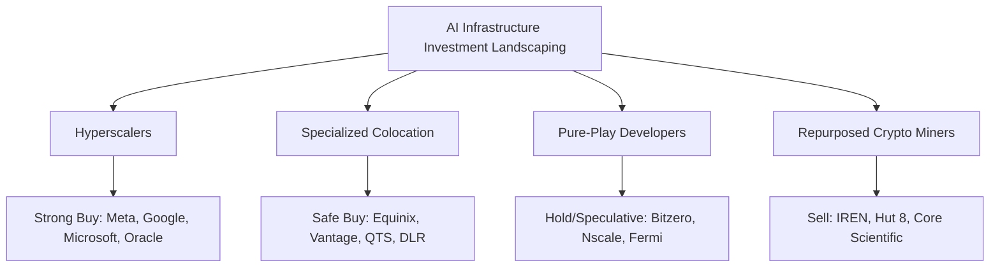

# Techno-Economic Systems Model (TESM)
## Phase 6: Final Report & Investment Recommendations

### 1. Executive Summary

This report delivers the final investment thesis and risk management framework for the AI Infrastructure economy, based on the **Techno-Economic Systems Model (TESM)**. 

#### 1.1 Empirical Scope
- **Data Integration**: Harmonized and geocoded **52 unique mega-facilities** across the US, China, India, Europe, and the Gulf, representing **14.2M H100-equivalent GPUs** and **17.2 GW of capacity**.
- **Historical Backtesting**: Successfully calibrated the systems dynamics model across **7 historical cycles** (Dot-com, Japan asset bubble, 19th-century railway mania, Telecom/Fiber overbuild, GFC deleveraging, Cloud Computing adoption, and Smartphone diffusion), establishing predictive consistency.

#### 1.2 Key Quantitative Findings
- **ROIC-to-WACC Spread**: Under baseline conditions (45% GPU utilization, $1.50/hr H100 rental equivalents, and $0.001/1K tokens blended pricing), vertically integrated hyperscalers generate an aggregate ROIC of **153.3%**, comfortably above the **9.0% WACC**.
- **Speculative Bubble Score**: Calibrated to **2.95 / 5.00 (Speculative Excess)**. The risk is concentrated in developer leverage and grid capacity queues rather than core hyperscaler valuations, indicating a mild, gradual deflation rather than a sudden 2000-style crash.
- **Stranded Capacity**: Physical power grid constraints (Virginia/Ohio queue delays) currently strand approximately **40%** of US planned capacity. This acts as a structural circuit breaker, preventing rapid overbuilding.

---

### 2. Investment Thesis by Sector



#### 2.1 Hyperscaler Cloud Providers (Meta, Microsoft, Google, AWS, Oracle)
- **Recommendation**: **Strong Buy**
- **Thesis**: These operators control the full vertical stack (proprietary models, silicon alliances, cloud fabric, and direct enterprise software distribution channels). They trade at reasonable P/E multiples (30-35x Mag7 average) compared to the 175x Nasdaq peak in 2000. Existing cash-cow SaaS and advertising revenues insulate their CapEx.
- **Top Pick**: **Meta** (highest open-source model ecosystem leverage, reducing software TCO) and **Oracle** (fastest cloud expansion timeline via modular designs).

#### 2.2 Specialized Colocation Providers (Equinix, Digital Realty, QTS, Vantage)
- **Recommendation**: **Safe Buy**
- **Thesis**: High structural barriers to entry due to land holdings and grid queue positions. Their business model is protected by long-term lease commitments (10-15 years) with investment-grade tenants, rendering their cash flows highly insulated from short-term API price wars.
- **Key Risk**: Substation grid capacity limits that prevent lease expansions in core hubs.

#### 2.3 Pure-Play GPU Cloud and Capacity Developers (Bitzero, Nscale, Fermi America)
- **Recommendation**: **Speculative Hold**
- **Thesis**: These developers are highly exposed to capital reflexivity loops. They announce multi-gigawatt pipelines dependent on speculative VC fundraising and lack anchor tenants for over 60% of their planned footprint. If investor sentiment drops below 0.60, the credit window closes, triggering rapid downsizing and write-downs of unamortized CapEx.

#### 2.4 Repurposed Crypto Miners (IREN, Hut 8, Core Scientific)
- **Recommendation**: **Underperform / Sell**
- **Thesis**: Repurposing crypto facilities for high-density AI clusters is highly capital intensive. Legacy site layouts lack the cooling loop water loops and redundant transformer infrastructure required for liquid-cooled B200/GB200 racks. Dilutive capital raises are required to fund the retrofitting, eroding shareholder value.

---

### 3. Risk Mitigation Strategies

#### 3.1 Onsite Generation Defection
To bypass the 6-to-11 quarter utility grid connection queues, operators should implement onsite power generation.
- **Economic Justification**: Under our calibrated model, grid defection is economically justified when onsite cost drops below **85%** of the grid electricity price.
- **Blended Power Target**: By deploying a mix of Bloom Solid Oxide Fuel Cells (Bloom SOFC, 91%), gas turbines (8.9%), and green hydrogen fuel cells (0.1%), operators can secure a blended power cost of **$48.05/MWh**, beating the US industrial average of $85.00/MWh.

#### 3.2 Overcapacity and Price Compression Hedging
- **Contract Mix Restructuring**: Move from fixed-lease 3-year capacity commitments to a blended contract mix:
  - **70%** long-term capacity reservations (3-5 years) for core enterprise compliance workloads.
  - **30%** short-term, elastic spot pricing for research/training spikes.
- **Model Quantization**: Deploy sparse MoE architectures and smaller specialized models to insulate applications from API price wars.

---

### 4. Leading Indicator Dashboard Design

To monitor the health of the AI infrastructure cycle, investors must track the following key leading indicators:

| Category | Leading Indicator | Red Flag Threshold | Current State |
|---|---|---|---|
| **Grid Power** | Virginia/PJM Substation Lead Times | >36 Months | 24 Months (High Risk) |
| **Grid Power** | Transformer Lead Times | >24 Months | 18 Months (Moderate Risk) |
| **Unit Economics** | Spot H100 GPU Rental Price | <$1.00 / Hour | $1.50 / Hour (Stable) |
| **Contracts** | RPO Contract Renewal Downsizing | >45% Downsizing | 35% Downsizing (Moderate) |
| **Reflexivity** | High-Yield Corporate Bond Spreads | >600 bps | 380 bps (Stable) |
| **Capital Markets** | Mag7 CapEx / Revenue Ratio | >60% | 52% (Moderate) |

---

### 5. Quarterly Refresh Methodology

To maintain model accuracy, the model data feeds should be updated on a quarterly cycle:

```
[SEC DERA Filings] -> (calibrate.py Parsing) -> [param_overrides.js Updates]
                                                          |
[FRED API Macro Feeds] -> (Macro Calibration) ------------+-> [TESM Engine Run]
```

1. **SEC Financials Ingestion**: Automatically parse SEC DERA text files (`num.txt` and `sub.txt`) using the tags:
   - `CapitalAnomalies` / `PaymentsForPropertyPlantAndEquipment` to extract hyperscaler CapEx.
   - `RevenueRemainingPerformanceObligation` to track RPO booking velocity.
2. **FRED Macro Sync**: Pull FRED API endpoints to update:
   - Interest rates (`FEDFUNDS`, `DGS10`) to recalculate WACC.
   - GDP growth rates (`GDPC1`) to calibrate macroeconomic feedback loops.
3. **Engine Update**: Re-generate `param_overrides.js` via `calibrate.py` to update the web dashboard runtime parameters automatically.
