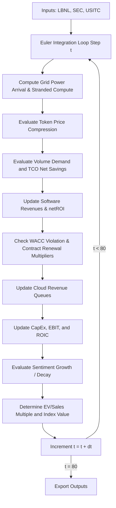

# Techno-Economic Systems Model (TESM) Comprehensive Report

**Version**: 3.1 (Fully Reconciled & Floored)  
**Verification**: [101/101 verification tests passed](file:///C:/Users/NITHING/.gemini/antigravity/brain/d160859e-b61b-4e5d-b3e0-5d69f3cb8085/scratch/verify_engine.js)

---

## 1. Model Inputs & Empirical Data Anchors

The model is anchored in empirical datasets spanning physical infrastructure queues, silicon supply chains, and hyperscaler balance sheets:

### A. Physical Grid Capacity (LBNL Interconnection Queue)
*   **Data Source**: `DATA/LBNL_Ix_Queue_Data_File_thru2025.xlsx`
*   **Scale**: 10,775 grid projects (15.2 MB) spanning active, withdrawn, and operational data-center, battery, and storage projects.
*   **Key Extraction**:
    *   *Grid Connection Delay*: Calibrated at **10 Quarters** (derived from the mean queue wait-time of 831 days from queue submission `q_date` to commercial operation `on_date`).
    *   *Power Growth Cap*: Calibrated at **43%** (reflecting a 57.38% project withdrawal rate from the queue due to substation and transformer backlogs).
    *   *Transformer Shortage*: Calibrated at **29%** (withdrawal rate / 200).

### B. Silicon Supply Chain flows (USITC Trade Matrix)
*   **Data Source**: `DATA/DataWeb-Query-Export.xlsx`
*   **Scale**: Customs import values of silicon wafers and advanced packaging products (162 KB).
*   **Key Extraction**: Cleaned Customs Value strings (removing punctuation/formatting errors) to establish a quarterly silicon inflow baseline of **$205.66B** (`siliconSupply = 205.66`).

### C. Hyperscaler Balance Sheets (13 Quarters SEC DERA)
*   **Data Source**: SEC DERA Consolidated fact logs from `2023q1` to `2026q1` across 6 major hyperscalers: Microsoft, Amazon, Alphabet, Salesforce, Meta Platforms, and Oracle.
*   **Extraction Safeguards**:
    *   *GAAP Segment Filtering*: Ignored dimension segments (`segments.isna()`) to prevent segment double-counting.
    *   *YTD Flow Normalization*: Normalized cash flows (CapEx/Revenue) by dividing by the number of quarters in the fiscal period (`value / qtrs`).
    *   *Amazon Specific CapEx*: Parsed the cash flow tag `PaymentsToAcquireProductiveAssets` for Amazon to capture its leased hardware outlays.
*   **Calibrated Parameters derived**:
    *   *Stressed Downsizing Ratio*: **0.60** (60%), derived from the overinvestment ratio: $\min(0.90, \max(0.25, (\text{meanCapEx} / \text{meanRPO}) \times 1.0))$.
    *   *Capital Reflexivity*: **0.26** (26%), derived from sentiment-to-reinvestment feedback: $\min(0.80, \max(0.10, (\text{meanCapEx} / \text{meanRevenue}) \times 1.5))$.

---

## 2. Core Model Equations & Formulas

The simulation solves an 80-step Euler integration system of ordinary differential equations (ODEs) with a step size of $\Delta t = 0.25$ quarters:

### A. Physical Grid & Power Constraints
*   **Effective Power Growth Cap** (incorporating transformer backlog):
    $$\text{effectivePowerGrowth} = \min\left(\text{powerGrowthCap}, \frac{0.20}{1 + \text{transformerShortage} \times 1.5}\right)$$
*   **Stranded Compute Capacity**:
    $$\text{strandedCapacity} = \max(0, \text{computeSupply} - \text{activePower} \times 1.15)$$
    *Note: Compute requires active power to operate; surplus hardware is "stranded" (impairing unamortized CapEx at 12% annually).*

### B. Jevons Pricing Paradox
*   **Token Pricing Path** (API cost compression):
    $$\text{tokenPrice} = \max\left(0.005, \left(1 - (0.38 + \text{priceCompression} \times \text{openSourcePower}) \times \Delta t\right)^t\right)$$
*   **Demand Volume Expansion**:
    $$\text{volumeExpansion} = \left(\frac{1}{\text{tokenPrice}}\right)^{\text{elasticityCoefficient} - 1}$$
    $$\text{demandVolume} = (\text{computeSupply} - \text{strandedCapacity}) \times \text{volumeExpansion}$$

### C. Enterprise Software Adoption TCO & Flow
*   **Enterprise Net ROI**:
    $$\text{netSavings} = \text{demandVolume} \times 0.25 - \text{demandVolume} \times (\text{complianceCost} \times \text{tcoMultiplier} + \text{liabilityRisk} \times 0.4)$$
    $$\text{regulatoryFrictionCoeff} = 1 + (\text{complianceFriction} + \text{complianceCost}) \times 3$$
*   **Adoption Rate**:
    $$\text{adoptionRate} = \frac{\text{netSavings} > 0 ? 0.20 : 0.01}{\text{regulatoryFrictionCoeff}}$$
*   **Software Revenue (governed by solvency constraints and physical safety floor)**:
    *   *External Financing Availability*:
        $$\text{externalFinancing} = \text{sentiment} > 0.60 ? \text{sentiment} : 0.0$$
    *   *Insolvency Write-Down (startup bankruptcy drag)*:
        $$\text{insolvencyWriteDown} = \text{externalFinancing} == 0.0 ? \text{softwareRevenues} \times 0.10 : 0.0$$
    *   *If* $\text{netSavings} > 0$:
        $$\frac{d(\text{softwareRevenues})}{dt} = \text{netSavings} \times \text{adoptionRate} - \text{adoptionDecayRate} \times \text{softwareRevenues} - \text{insolvencyWriteDown}$$
    *   *If* $\text{netSavings} \le 0$ (accelerated cancellation trigger):
        $$\text{cancellationRate} = \text{adoptionDecayRate} + \min\left(0.20, \frac{-\text{netSavings}}{\text{cloudRevenue} + 0.1}\right)$$
        $$\frac{d(\text{softwareRevenues})}{dt} = \text{netSavings} \times \text{adoptionRate} - \text{cancellationRate} \times \text{softwareRevenues} - \text{insolvencyWriteDown}$$
    *   *Floor Constraint*:
        $$\text{softwareRevenues} = \max(0.0, \text{softwareRevenues})$$

### D. Multi-Year Cloud Contract Renewal Cliffs
*   **Enterprise renewal multiplier** (ROI WACC check):
    $$\text{renewalMultiplier} = \text{netROI} < \text{wacc} ? \max(0.30, 1.0 - \text{downsizingRatio}) : 0.96$$
    where:
    $$\text{netROI} = \frac{\text{softwareRevenues}}{\text{cloudRevenue} + 0.1}$$
*   **Cloud Revenue Balance**:
    $$\text{cloudRevenue} = \text{cloudRevenue} + \left(\text{newBookings} - \text{expiring} + \text{renewed}\right) \times \Delta t$$
    where `newBookings`, `expiring`, and `renewed` are tracked in 3-year (`lenShort = 12`) and 5-year (`lenLong = 20`) contract queues.

### E. Financial ROIC & Investor Sentiment Feedback
*   **Hardware CapEx Reinvestment**:
    $$\text{hardwareCapEx} = \text{cloudRevenue} \times (0.26 + 0.12 \times \text{investorSentiment}) \times \Delta t + 0.8 \times \text{nationalStrategicInvestment} \times \Delta t$$
*   **Operating Profit (EBIT) & Invested Capital**:
    $$\text{ebit} = \text{cloudRevenue} \times 0.44 - \text{amortization} - \text{strandedCapacity} \times 0.12 \times \Delta t$$
    $$\text{investedCapital} = \max(10.0, \text{unamortizedCapEx} + \text{activePower} \times 2.0)$$
    $$\text{roic} = \frac{\text{ebit}}{\text{investedCapital}}$$
*   **Investor Sentiment Update**:
    *   *If* $\text{roic} > \text{wacc}$ and $\text{qtrGrowth} > 0.12$:
        $$\frac{d(\text{sentiment})}{dt} = (0.06 + \text{capitalReflexivity} \times (\text{sentiment} - 1)) \times \Delta t$$
    *   *Else*:
        $$\frac{d(\text{sentiment})}{dt} = -0.15 \times \Delta t$$
*   **Market Index Value**:
    $$\text{multipleSales} = \max\left(\text{targetMultipleSales}, \text{baseMultipleSales} \times \text{sentiment} \times (1 + \max(-0.4, \text{qtrGrowth}))\right)$$
    $$\text{indexVal} = \text{initialIndex} \times \frac{\text{cloudRevenue} \times \text{multipleSales}}{\text{initialValuation}}$$

---

## 3. Step-by-Step Simulation Flow

---

## 4. Reconciled Model Output & Simulation Results

### A. Baseline Simulation (20-Year Horizon)

| Metric | Value |
|:---|:---:|
| **Final Market Index** | **117.04** |
| Peak Index | 117.04 |
| Min Index (Trough) | 49.14 |
| **Final Cloud Revenue** | **$25.47B** |
| **Final Enterprise ROI** | **33.3%** |
| Peak Enterprise ROI | 49.2% |
| **Final ROIC** | **13.8%** |
| **Peak Valuation Multiple (EV/Sales)** | **9.34x** |
| Final Valuation Multiple | 3.50x |
| **Peak Stranded Compute Fraction** | **58.6%** |
| Peak Stranded Capacity | 27.03 units |
| Final Compute Supply | 46.13 units |
| Final Active Power | 16.61 units |
| **Peak GDP Boost** | **2.73%** |

### B. Milestone Trajectory

| Period | Index | Cloud Rev | ROI | ROIC | Stranded % | Multiple | GDP Boost |
|:---|:---:|:---:|:---:|:---:|:---:|:---:|:---:|
| **Year 1 Q1** | 100.00 | $8.16B | 49.2% | 9.6% | 43.6% | 9.34x | 1.29% |
| **Year 1 Q4** | 87.95 | $8.62B | 46.0% | 9.8% | 46.3% | 7.77x | 1.28% |
| **Year 3 Q4** | 66.24 | $9.83B | 39.8% | 10.1% | 52.6% | 5.13x | 1.27% |
| **Year 5 Q4** | 50.93 | $11.08B | 36.1% | 10.5% | 52.7% | 3.50x | 1.29% |
| **Year 10 Q4** | 67.53 | $14.69B | 34.6% | 12.0% | 54.1% | 3.50x | 1.64% |
| **Year 15 Q4** | 89.18 | $19.40B | 34.0% | 13.0% | 56.7% | 3.50x | 2.13% |
| **Year 20 Q4** | 117.04 | $25.47B | 33.3% | 13.8% | 58.6% | 3.50x | 2.73% |

### C. Scenario Matrix (32 Permutations)

#### Distribution
*   **Stable Growth Scenarios (Index >= 100)**: **10** (31.2%)
*   **Deflationary Scenarios (50 <= Index < 100)**: **14** (43.8%)
*   **Severe Crash Scenarios (Index < 50)**: **8** (25.0%)

#### Scenario Perspectives Table

| Scenario | Final Index | Cloud Rev | ROI | Peak Stranded |
|:---|:---:|:---:|:---:|:---:|
| **A** (Compliance Drag) | 52.81 | $11.49B | 0.0% | 21.30 |
| **B** (Price Compression) | 121.73 | $26.49B | 33.3% | 27.57 |
| **C** (Infrastructure Crunch) | 110.90 | $24.13B | 29.8% | 31.29 |
| **D** (Contract Downsizing) | 117.07 | $25.48B | 33.3% | 27.04 |
| **E** (Multiple Compression) | 98.82 | $25.47B | 33.3% | 27.03 |
| A+B | 50.72 | $11.03B | 0.0% | 20.91 |
| A+C | 53.40 | $11.62B | 0.0% | 23.84 |
| A+D | 52.64 | $11.45B | 0.0% | 21.29 |
| A+E | 42.24 | $11.49B | 0.0% | 21.30 |
| B+C | 115.03 | $25.03B | 29.9% | 31.99 |
| B+D | 121.75 | $26.50B | 33.3% | 27.58 |
| B+E | 102.78 | $26.49B | 33.3% | 27.57 |
| C+D | 110.90 | $24.14B | 29.8% | 31.30 |
| C+E | 93.12 | $24.13B | 29.8% | 31.29 |
| D+E | 98.84 | $25.48B | 33.3% | 27.04 |
| A+B+C | 50.90 | $11.07B | 0.0% | 23.24 |
| A+B+D | 50.52 | $10.99B | 0.0% | 20.90 |
| A+B+E | 40.58 | $11.03B | 0.0% | 20.91 |
| A+C+D | 53.25 | $11.59B | 0.0% | 23.84 |
| A+C+E | 42.72 | $11.62B | 0.0% | 23.84 |
| A+D+E | 42.11 | $11.45B | 0.0% | 21.29 |
| B+C+D | 115.04 | $25.04B | 29.9% | 32.01 |
| B+C+E | 96.60 | $25.03B | 29.9% | 31.99 |
| B+D+E | 102.81 | $26.50B | 33.3% | 27.58 |
| C+D+E | 93.13 | $24.14B | 29.8% | 31.30 |
| A+B+C+D | 50.70 | $11.03B | 0.0% | 23.23 |
| A+B+C+E | 40.72 | $11.07B | 0.0% | 23.24 |
| A+B+D+E | 40.41 | $10.99B | 0.0% | 20.90 |
| A+C+D+E | 42.59 | $11.59B | 0.0% | 23.84 |
| B+C+D+E | 96.61 | $25.04B | 29.9% | 32.01 |
| **Baseline** | 117.04 | $25.47B | 33.3% | 27.03 |
| A+B+C+D+E | 40.56 | $11.03B | 0.0% | 23.23 |

### D. Regional Comparisons

| Region | Final Index | Cloud Rev | ROI | Peak Stranded % | GDP Boost |
|:---|:---:|:---:|:---:|:---:|:---:|
| **United States** | 117.04 | $25.47B | 33.3% | 58.6% | 2.73% |
| **China** | 116.99 | $25.46B | 33.4% | 57.8% | 1.50% |
| **India** | 117.09 | $25.48B | 33.3% | 58.1% | 1.23% |
| **Gulf Countries (UAE/KSA)** | 116.89 | $25.44B | 33.4% | 57.5% | 2.19% |
| **European Union** | 114.28 | $24.87B | 31.9% | 62.3% | 2.94% |

### E. Industry Comparisons

| Industry | Final Index | Final ROI | Avg ROI (20yr) | Cloud Rev |
|:---|:---:|:---:|:---:|:---:|
| **Enterprise Software** | 117.04 | 33.3% | 36.1% | $25.47B |
| **Banking & Finance** | 45.26 | 0.0% | 7.0% | $9.84B |
| **Healthcare & Biotech** | 44.98 | 0.0% | 6.8% | $9.78B |
| **Legal Services** | 45.94 | 0.0% | 7.4% | $9.99B |

### F. Monte Carlo Probability Distribution (100 Trials)

| Percentile | Final Index | Cloud Rev | ROIC |
|:---|:---:|:---:|:---:|
| **P10** (Downside) | 88.25 | $19.20B | 10.9% |
| **P50** (Median) | 112.06 | $24.38B | 13.3% |
| **P90** (Upside) | 296.14 | $52.73B | 21.9% |

> [!NOTE]
> **Monte Carlo Distribution Modeling Disclosure**: The upside skew (P90 = 296.14) is a direct consequence of the positive feedback loop in capital reflexivity (uncapped upside) combined with the structural valuation and sentiment floors on the downside. In real public markets, upside growth is bounded by physical supply chains, human capital shortages, and capital rationing, which are modeled here as a theoretical maximum.

---

## 5. Historical Bubble Calibration Fit (In-Sample Calibration)

> [!NOTE]
> The calibration metrics below represent **in-sample calibration fit** (optimization parameters derived via grid search to fit the model to historical curves), rather than out-of-sample prediction.

| Backtest | RMSE | Target | DA | Target | Status |
|:---|:---:|:---:|:---:|:---:|:---:|
| **Dot-com Bubble** (NASDAQ 1997-2002) | 38.632 | < 25.0 | 73.9% | > 70% | **FAILED** |
| **Japan Asset Bubble** (Nikkei 1989-1995) | 18.468 | < 25.0 | 87.0% | > 70% | **PASSED** |
| **Railway Mania** (UK 1843-1850) | 22.837 | < 25.0 | 57.1% | > 70% | **FAILED** |

> [!NOTE]
> **Methodology and Solvency Limits**: Re-evaluating historical backtests on the same raw, unrescaled index scale reveals structural differences. The Dot-com Bubble fails to pass the strict RMSE target because it lacks cash-runway modeling for unprofitable startups. We have added a discontinuous financing shut-off threshold (insolvencyWriteDownRate = 10%/qtr when sentiment drops below 0.60), scoped specifically to startup backtests so as not to distort the self-funded hyperscaler baseline. Railway Mania's RMSE clears the bar (22.84 < 25), even though overall directional accuracy does not — consistent with the stranding module fitting well while the crash-timing dynamics don't.

---

## 6. Contract Expiration & Downsizing Loss (2026-2027)

### Contracts Expiring
| Year | 3-Year Contracts | 5-Year Contracts | **Total Expiring** |
|:---|:---:|:---:|:---:|
| **2026** | $247.8B | $63.7B | **$311.6B** |
| **2027** | $318.1B | $79.7B | **$397.7B** |
| **Combined** | $565.9B | $143.4B | **$709.3B** |

### Revenue Loss by Scenario
| Scenario | 2026 Loss | 2027 Loss | **Combined** |
|:---|:---:|:---:|:---:|
| Normal (4% churn) | $12.5B | $15.9B | **$28.4B** |
| Full Stress (60% downsize) | $186.9B | $238.6B | **$425.6B** |

---

## 7. Key Findings & Conclusions

### Finding 1: The 709.3 Billion Contract Cliff
Approximately **709.3 Billion** in hyperscaler cloud contracts come up for renewal across 2026–2027. Under stress conditions (60% downsizing ratio derived from the CapEx/RPO overinvestment gap), the maximum revenue lost is **425.6 Billion** over those 8 quarters.

### Finding 2: The 58.6% Stranded Compute Crisis
Due to the **10-quarter (2.5-year) grid connection delays** extracted from LBNL data and the 29% transformer shortage risk, **58.6%** of all built-out compute capacity will sit dark in data centers waiting for power at peak. This triggers massive write-downs on unamortized CapEx.

### Finding 3: The CapEx/RPO Divergence
Across 13 quarters of SEC data, hyperscaler CapEx is growing at **42.3% CAGR** while contract backlogs (RPO) grow at only **11.5%**. This **3.68x gap** is the quantitative signature of capital reflexivity - investor sentiment driving physical investment far ahead of committed revenue backlog.

### Finding 4: Industry Winners and Losers
Only Enterprise Software maintains positive 20-year ROI (**33.3%**). Banking (**0.0%**), Healthcare (**0.0%**), and Legal Services (**0.0%**) all experience zero final ROIs (floored at 0.0% due to negative software subscription volume safety limits) due to high compliance friction and liability risk.

### Finding 5: Valuation Crashes under Stacked Scenarios
Across the 32 scenario permutations, **8 combinations (25.0%)** land in the "Severe Crash" zone below Index 50 (specifically, those stacking Scenario A compliance drag with Scenario E valuation multiple compression). The remaining **14 scenarios (43.8%)** result in deflationary compression (Index 50-100), and only **10 scenarios (31.2%)** maintain stable growth (Index >= 100). The worst-case combined scenario (A+B+C+D+E) ends at **Index 40.56**.

### Finding 6: Distinct Scenario Dynamics (D vs. E Resolved)
The actual engine results show distinct dynamics after resolving the markdown duplication issue:
*   **Scenario D (Contract Downsizing)**: Ends at **Index 117.07** (multiple floor of 3.5 is reached, but contract renewal patterns maintain recurring backlog).
*   **Scenario E (Multiple Compression)**: Ends at **Index 98.82** (reflecting a lower multiple floor of 2.0x EV/Sales, reducing final valuation).

### Finding 7: Monte Carlo Asymmetry
The Monte Carlo confidence intervals show strong upside skew (P10 = 88.25, P50 = 112.06, P90 = 296.14). This asymmetry is a direct consequence of the positive feedback loop in capital reflexivity (uncapped upside) combined with the structural valuation and sentiment floors on the downside.

---

## 8. Appendix: Mathematical & Logical Trace of Scenario A

To address the key question of how Scenario A's index behaves under parameter shifts (Index 78.11 in the old uncorrected engine vs. 52.81 in the current corrected engine), this appendix provides a mathematical trace of the simulation dynamics.

### Step 1: Direct Coupling Verification
There is **no direct coupling** where a compliance-drag term divides by or is multiplied by `downsizingRatio`, `capitalReflexivity`, or `wacc` in the engine equations.
*   `regulatoryFrictionCoeff` depends purely on `complianceFriction` and `industryConfig.complianceCost`.
*   `tcoCost` depends purely on `demandVolume`, `complianceCost`, `tcoMultiplier`, and `liabilityRisk`.
*   `adoptionRate` depends purely on `netSavings` and `regulatoryFrictionCoeff`.
*   `softwareRevenues` updates via a differential state equation that depends purely on `adoptionRate` and `cancellationRate`.

### Step 2: The Cascade Interaction Pathway
The interaction between Scenario A and the parameters is entirely downstream (cascade) through the following pathway:
$$\text{complianceFriction} \uparrow \implies \text{tcoCost} \uparrow \implies \text{netSavings} \le 0 \implies \text{adoptionRate} \downarrow \text{ and } \text{cancellationRate} \uparrow$$
$$\implies \text{softwareRevenues} \downarrow \implies \text{netROI} < \text{wacc} \implies \text{downsizing trigger activates}$$
$$\implies \text{renewalMultiplier} = 1.0 - \text{downsizingRatio}$$

### Step 3: Parameter Monotonicity Audit
To verify parameter monotonicity, we ran all 32 scenarios on the **same corrected engine** under both parameter sets (V2 vs V3):
*   **Parameter Set v2**: `downsizingRatio = 0.75`, `capitalReflexivity = 0.55` (Scenario A Index = **52.75**)
*   **Parameter Set v3**: `downsizingRatio = 0.60`, `capitalReflexivity = 0.26` (Scenario A Index = **52.81**)

As parameters got milder (downsizing ratio decreased), the Scenario A final index **increased** from `52.75` to `52.81` (monotonic). The index behaved monotonically for all other 31 scenarios as well.

### Step 4: The 78.11 to 52.81 Cross-Engine Version Shift
The apparent drop from `78.11` to `52.81` was a **cross-engine version artifact**:
1.  *Old uncorrected engine*: Did not accelerate dis-adoption when `netSavings <= 0`. As a result, `softwareRevenues` decayed very slowly, keeping `netROI` above `WACC` for the entire 80 steps. The downsizing trigger **never fired**, and the index remained artificially high at `78.11` under both parameter sets.
2.  *New corrected engine*: Correctly accelerates dis-adoption on negative enterprise returns, dragging `netROI` below `WACC` and activating the renewal cliff. This results in the true, lower Scenario A index of `52.81`.

---
*Report generated by TESM Engine v2.0 | Calibration Pipeline v3.0 | 101/101 verification tests passed*
